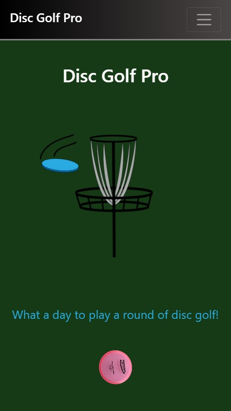
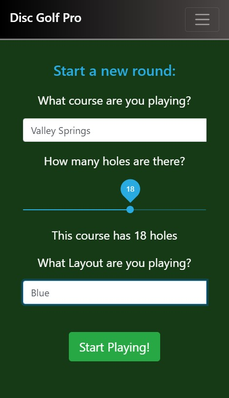
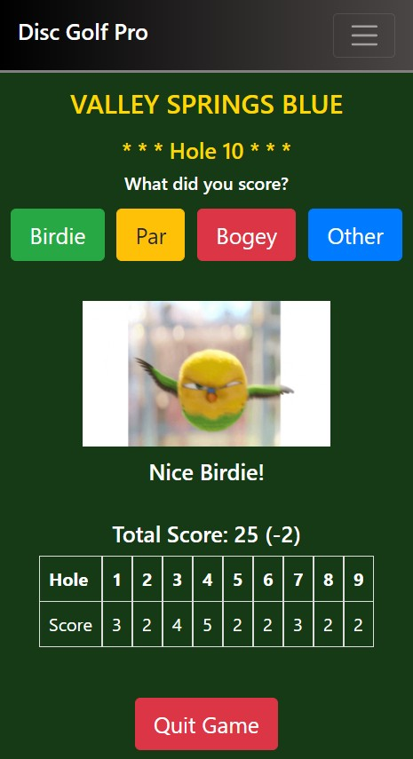
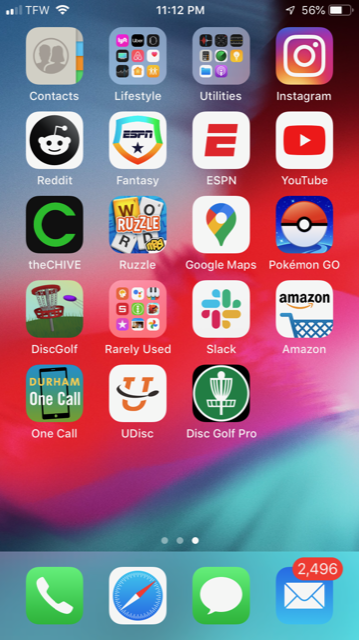

# DiscGolfPro
 
 https://alexcoulter.github.io/DiscGolfPro/#/

## Table of Contents

* [User Story](#user-story)
* [Installation](#installation)
* [Screenshots](#screenshots)
* [Built With](#built-with)

## User Story
As a user, I want to be able to keep score while I play a round of disc golf.  I want to be able to input the course and layout I'm playing as well as the number of holes.  I would like to be able to input my score on a hole-by-hole basis and see a score card as well as my total score for the round.  I would like to have different gifs and images pop up that relate to how well I did on the previous hole.  I would also like this to be a Progressive Web App(PWA) that is mobile-first and can be loaded on my phone with a distinct icon.  It should also utilize the cache API to run even without a connection to the internet.

## Installation

 * Clone this repository from Github from the command line by typing:  
   `git clone git@github.com:alexcoulter/DiscGolfPro.git`
  * Navigate to the 'discgolfpro' folder by typing:  
  `cd discgolfpro` 
  * Install dependencies by typing:  
   `npm install`
  * Run this application by typing:   
  `npm start` 
  * React will automatically open this app in your browser at `http://localhost:3000/DiscGolfPro#/`

  ## Screenshots
* Home Screenshot

* Course Info Screenshot

* Mid-Round Screenshot

* Screenshot of Icon on Phone

   

   ## Built With  

* **React** - One of the most powerfull, popular Javascript libraries. Used for creating interactive UI.

